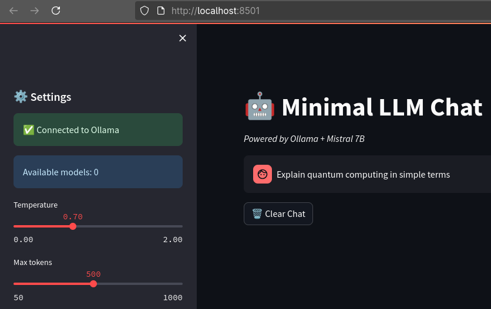
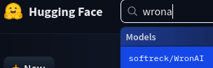

# 🚀 WronAI - Własny model językowy po polsku

[](https://opensource.org/licenses/MIT)
[](https://www.python.org/downloads/)



Kompletne narzędzie do tworzenia, dostrajania i wdrażania własnych modeli językowych opartych na Mistral 7B, z pełnym wsparciem dla języka polskiego.

## 📋 Spis treści
- [Szybki start](#-szybki-start)
- [Funkcje](#-funkcje)
- [Wymagania](#-wymagania)
- [Instalacja](#-instalacja)
- [Użycie](#-użycie)
- [Struktura projektu](#-struktura-projektu)
- [Przykłady użycia](#-przykłady-użycia)
- [Wdrażanie](#-wdrażanie)
- [Licencja](#-licencja)

## 🚀 Szybki start

### Wymagania wstępne
- Python 3.8+
- [Ollama](https://ollama.ai/) (zalecane)
- CUDA (opcjonalne, do akceleracji GPU)

### Instalacja
```bash
# 1. Sklonuj repozytorium
git clone https://github.com/wronai/llm-demo.git
cd llm-demo

# 2. Utwórz i aktywuj środowisko wirtualne
python -m venv .venv
source .venv/bin/activate  # Linux/Mac
# lub
.venv\Scripts\activate    # Windows

# 3. Zainstaluj zależności
pip install -r model_requirements.txt
```

### Uruchomienie demo
```bash
# Uruchom interfejs webowy
streamlit run app/main.py
```

## 💻 Przykłady kodu

### Rozmowa z modelem
```python
import requests

response = requests.post(
    "http://localhost:11434/api/generate",
    json={
        "model": "wronai",
        "prompt": "Napisz krótki wiersz o sztucznej inteligencji"
    }
)
print(response.json()["response"])
```

### Integracja z Pythonem
```python
from transformers import pipeline

# Załaduj model
pipe = pipeline("text-generation", model="wronai")

# Wygeneruj tekst
result = pipe("Jakie są zalety uczenia maszynowego?")
print(result[0]["generated_text"])
```

## ✨ Funkcje

- **Gotowy model WronAI** - Działa od razu po zainstalowaniu
- **Dostosowywanie** - Możliwość dostrojenia pod własne potrzeby
- **Interfejs webowy** - Prosty interfejs do rozmowy z modelem
- **Obsługa GPU** - Pełne wsparcie dla akceleracji sprzętowej
- **Gotowy do produkcji** - Łatwe wdrożenie z Dockerem

## 🛠️ Wymagania

- System operacyjny: Linux, macOS lub Windows (z WSL2)
- RAM: Minimum 16GB (32GB zalecane)
- Dysk: Minimum 10GB wolnego miejsca
- Karta graficzna: NVIDIA z obsługą CUDA (opcjonalnie)

## 📁 Struktura projektu

```
llm-demo/
├── app/                    # Aplikacja Streamlit
│   └── main.py             # Główny plik aplikacji
├── models/                 # Modele i wagi
├── data/                   # Zbiory danych
├── scripts/                # Przydatne skrypty
├── docker-compose.yml       # Konfiguracja Docker Compose
├── Dockerfile              # Konfiguracja kontenera
├── requirements.txt         # Zależności Pythona
├── model_requirements.txt   # Zależności do modeli
└── README.md               # Ten plik
```

## 🚀 Użycie

### Uruchomienie modelu WronAI

```bash
# Upewnij się, że Ollama jest uruchomiony
ollama serve &


# Uruchom model WronAI
ollama run wronai "Cześć! Jak mogę Ci pomóc?"
```

### Dostosowywanie modelu

1. Przygotuj dane treningowe w formacie JSONL:
```json
{"instruction": "Napisz wiadomość powitalną", "input": "", "output": "Witaj! Jak mogę Ci pomóc?"}
{"instruction": "Wyjaśnij czym jest AI", "input": "", "output": "Sztuczna inteligencja to dziedzina informatyki..."}
```

2. Uruchom proces dostrajania:
```bash
python create_custom_model.py
```

3. Wybierz odpowiednią opcję z menu.

### Krok 2: Przygotowanie danych
```bash
python create_custom_model.py
# Wybierz opcję 1: Stwórz sample dataset
```

Przykład danych treningowych:
```json
[
  {
    "instruction": "Jak nazywa się stolica Polski?",
    "input": "",
    "output": "Stolica Polski to Warszawa."
  },
  {
    "instruction": "Wyjaśnij czym jest sztuczna inteligencja",
    "input": "",
    "output": "Sztuczna inteligencja (AI) to dziedzina informatyki..."
  }
]
```

### Krok 3: Fine-tuning modelu
```bash
# Uruchom fine-tuning (wymaga GPU)
python create_custom_model.py
# Wybierz opcję 2: Fine-tune model

# Lub pełny pipeline
python create_custom_model.py
# Wybierz opcję 6: Pełny pipeline
```

**Optymalizacje dla RTX 3050:**
- 4-bit quantization
- LoRA (Low-Rank Adaptation)
- Batch size = 1
- Gradient accumulation = 4
- Mixed precision (FP16)

### Krok 4: Konwersja do GGUF
```bash
# Automatycznie generowany skrypt
./convert_to_gguf.sh
```

### Krok 5: Stworzenie modelu w Ollama
```bash
# Utwórz Modelfile
python create_custom_model.py  # wybierz opcję 4

# Stwórz model w Ollama
ollama create wronai -f Modelfile

# Uruchom model
ollama run wronai
```

### Uruchamianie skryptu
Skrypt `create_custom_model.py` oferuje interaktywne menu z następującymi opcjami:

```bash
python create_custom_model.py
```



Dostępne opcje:
1. Stwórz przykładowy dataset
2. Wykonaj fine-tuning modelu
3. Konwertuj model do formatu GGUF
4. Utwórz Modelfile dla Ollama
5. Opublikuj model na Hugging Face
6. Wykonaj pełny pipeline (1-5)

### Wymagania wstępne
- Python 3.8+
- PyTorch z obsługą CUDA (zalecane)
- Biblioteki wymienione w `model_requirements.txt`
- Konto na [Hugging Face](https://huggingface.co/) (do publikacji modelu)

### Rozwiązywanie problemów

#### Błąd składni w skrypcie
Jeśli napotkasz błąd składni, upewnij się, że:
1. Używasz Pythona 3.8 lub nowszego
2. Wszystkie zależności są zainstalowane
3. Plik nie został uszkodzony podczas pobierania

#### Problemy z zależnościami
```bash
# Utwórz i aktywuj środowisko wirtualne
python -m venv .venv
source .venv/bin/activate  # Linux/Mac
.venv\Scripts\activate    # Windows

# Zainstaluj zależności
pip install -r model_requirements.txt
```

#### Brakujące uprawnienia
Jeśli napotkasz problemy z uprawnieniami, spróbuj:
```bash
# Nadaj uprawnienia do wykonywania skryptów
chmod +x *.sh

# Uruchom z uprawnieniami administratora (jeśli potrzebne)
sudo python create_custom_model.py
```

### Kontrybucja
Zapraszamy do zgłaszania problemów i propozycji zmian poprzez Issues i Pull Requests.

# Test modelu
ollama run wronai "Cześć! Kim jesteś?"
```

### Krok 6: Publikacja modelu

#### **Opcja A: Ollama Registry**
```bash
# Push do Ollama Library
ollama push wronai

# Teraz każdy może użyć:
ollama pull your-username/wronai
```

#### **Opcja B: Hugging Face Hub**
```bash
# Publikacja na HF
python publish_to_hf.py

# Model dostępny na:
# https://huggingface.co/your-username/my-custom-mistral-7b
```

#### **Opcja C: Docker Registry**
```bash
# Spakuj do Docker image
docker build -t my-custom-llm .
docker tag my-custom-llm your-registry/my-custom-llm
docker push your-registry/my-custom-llm
```

## 🎯 **CZĘŚĆ 3: Gotowe alternatywy (zero kodu)**

### **1. Najprostsze - Ollama**
```bash
# Instalacja
curl -fsSL https://ollama.ai/install.sh | sh

# Uruchomienie modelu
ollama run mistral:7b-instruct

# API automatycznie na localhost:11434
```

### **2. Hugging Face Inference API**
```python
import requests

headers = {"Authorization": "Bearer YOUR_HF_TOKEN"}
response = requests.post(
    "https://api-inference.huggingface.co/models/mistralai/Mistral-7B-Instruct-v0.1",
    headers=headers,
    json={"inputs": "Hello!"}
)
```

### **3. Groq (ultra szybkie)**
```python
from openai import OpenAI

client = OpenAI(
    api_key="YOUR_GROQ_KEY",
    base_url="https://api.groq.com/openai/v1"
)

response = client.chat.completions.create(
    model="mistral-7b-instruct",
    messages=[{"role": "user", "content": "Hello!"}]
)
```

### **4. Together.ai**
```python
from openai import OpenAI

client = OpenAI(
    api_key="YOUR_TOGETHER_KEY",
    base_url="https://api.together.xyz/v1"
)

# Kompatybilne z OpenAI API
```

### **5. Modal.com (serverless GPU)**
```python
import modal

stub = modal.Stub("llm-api")

@stub.function(gpu="T4")
def generate(prompt: str):
    # Twój kod modelu
    return model.generate(prompt)

# Deploy jedną komendą
# modal deploy
```

## 🚀 Wdrażanie

### Z Dockerem

```bash
# Zbuduj i uruchom kontenery
docker-compose up --build

# Tylko budowanie
# docker-compose build

# Uruchomienie w tle
# docker-compose up -d

# Wyświetl logi
# docker-compose logs -f
```

### Konfiguracja środowiska produkcyjnego

1. **Nginx jako reverse proxy**
   ```nginx
   server {
       listen 80;
       server_name twojadomena.pl;

       location / {
           proxy_pass http://localhost:8501;
           proxy_http_version 1.1;
           proxy_set_header Upgrade $http_upgrade;
           proxy_set_header Connection 'upgrade';
           proxy_set_header Host $host;
           proxy_cache_bypass $http_upgrade;
       }
   }
   ```

2. **Konfiguracja systemd**
   ```ini
   # /etc/systemd/system/wronai.service
   [Unit]
   Description=WronAI Service
   After=network.target

   [Service]
   User=www-data
   WorkingDirectory=/path/to/llm-demo
   ExecStart=/usr/bin/docker-compose up
   Restart=always

   [Install]
   WantedBy=multi-user.target
   ```

3. **Monitorowanie**
   - Użyj `docker stats` do monitorowania zużycia zasobów
   - Skonfiguruj alerty w przypadku awarii
   - Regularnie sprawdzaj logi aplikacji

## 🛠️ Utrzymanie i rozwój

### Testowanie
```bash
# Uruchom testy jednostkowe
pytest tests/

# Sprawdź jakość kodu
flake8 .
# Sprawdź bezpieczeństwo zależności
safety check
```

### Wersjonowanie

Używamy [SemVer](https://semver.org/) do wersjonowania. Dostępne wersje możesz zobaczyć w [tagach repozytorium](https://github.com/wronai/llm-demo/tags).

## 🤝 Kontrybucja

1. Sforkuj repozytorium
2. Utwórz nowy branch (`git checkout -b feature/nowa-funkcjonalnosc`)
3. Zatwierdź zmiany (`git commit -am 'Dodano nową funkcjonalność'`)
4. Wypchnij zmiany (`git push origin feature/nowa-funkcjonalnosc`)
5. Otwórz Pull Request

## 📜 Licencja

Ten projekt jest dostępny na licencji MIT - zobacz plik [LICENSE](LICENSE) aby poznać szczegóły.

## 📞 Kontakt

- **Strona internetowa**: [wronai.pl](https://wronai.pl)
- **Email**: kontakt@wronai.pl
- **Twitter**: [@wronai](https://twitter.com/wronai)

---

<div align="center">
  <p>Made with ❤️ by <a href="https://wronai.pl">WronAI Team</a></p>
  <p>Jeśli podoba Ci się ten projekt, daj nam ⭐ na <a href="https://github.com/wronai/llm-demo">GitHubie</a>!</p>
</div>

### **1. Streamlit (Python)**
```python
import streamlit as st

st.title("My LLM Chat")
prompt = st.text_input("Message:")
if st.button("Send"):
    response = generate(prompt)
    st.write(response)
```

### **2. Gradio (Python)**
```python
import gradio as gr

def chat(message, history):
    response = generate(message)
    history.append([message, response])
    return "", history

gr.ChatInterface(chat).launch()
```

### **3. Next.js + Vercel AI SDK**
```tsx
import { useChat } from 'ai/react'

export default function Chat() {
  const { messages, input, handleInputChange, handleSubmit } = useChat()
  
  return (
    <div>
      {messages.map(m => <div key={m.id}>{m.content}</div>)}
      <form onSubmit={handleSubmit}>
        <input value={input} onChange={handleInputChange} />
      </form>
    </div>
  )
}
```

## 🎯 **CZĘŚĆ 5: Porównanie rozwiązań**

| Rozwiązanie | Setup Time | Kód | Hosting | GPU |
|-------------|------------|-----|---------|-----|
| **Ollama + Streamlit** | 2 min | 50 linijek | Local/Docker | Optional |
| **Hugging Face API** | 30 sec | 5 linijek | Cloud | No |
| **Groq API** | 1 min | 5 linijek | Cloud | No |
| **Modal.com** | 5 min | 20 linijek | Serverless | Auto |
| **Custom Fine-tuning** | 2 hours | 200 linijek | Self-hosted | Required |

## 🛠️ **Debugging & Tips**

### Typowe problemy
```bash
# Model nie ładuje się
docker logs ollama-engine

# Brak GPU
docker run --rm --gpus all nvidia/cuda:11.8-base nvidia-smi

# Port zajęty
sudo netstat -tlnp | grep 11434

# Restart wszystkiego
docker compose down && docker compose up -d
```

### Optymalizacje RTX 3050
```python
# W fine-tuningu
model = AutoModelForCausalLM.from_pretrained(
    model_name,
    load_in_4bit=True,        # 4-bit quantization
    torch_dtype=torch.float16 # Half precision
)

# Training args
TrainingArguments(
    per_device_train_batch_size=1,   # Mały batch
    gradient_accumulation_steps=4,   # Gradients accumulation
    fp16=True                        # Mixed precision
)
```

### Monitoring zasobów
```bash
# GPU monitoring
watch -n 1 nvidia-smi

# Container resources
docker stats

# Model memory usage
docker exec -it ollama-engine ollama ps
```

## 🎯 **Następne kroki**

### Dla nauki:
1. **Eksperymentuj z różnymi modelami** - Llama, CodeLlama, Phi-3
2. **Testuj różne techniki fine-tuningu** - LoRA, QLoRA, Full fine-tuning
3. **Dodaj RAG** - Retrieval Augmented Generation
4. **Stwórz multi-agent system**

### Dla produkcji:
1. **Przejdź na managed service** - Groq, Together.ai
2. **Setup monitoring** - LangSmith, Weights & Biases
3. **Dodaj cache** - Redis dla odpowiedzi
4. **Implement rate limiting**

### Dla biznesu:
1. **Fine-tune na własnych danych**
2. **Setup A/B testing** różnych modeli
3. **Dodaj feedback loop** od użytkowników
4. **Monetize API**

## 🎉 **Podsumowanie**

**Wybierz opcję według potrzeb:**

- **Demo/nauka**: Ollama + Streamlit (to rozwiązanie)
- **Prototyp**: Hugging Face API + Gradio
- **MVP**: Groq API + Next.js
- **Produkcja**: Modal/RunPod + custom frontend
- **Enterprise**: Fine-tuned model + własna infrastruktura

**Minimalne rozwiązanie = 5 plików, 50 linijek kodu, 2 minuty setup!**

